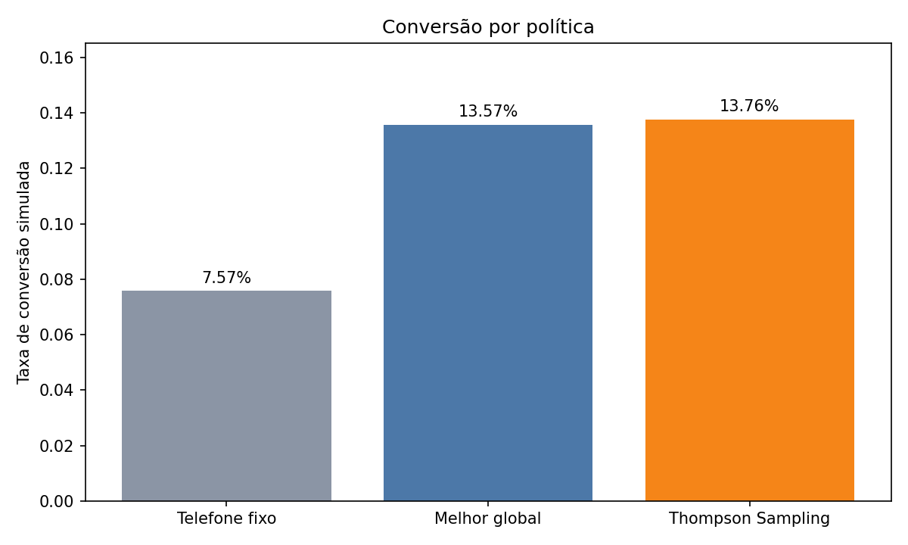
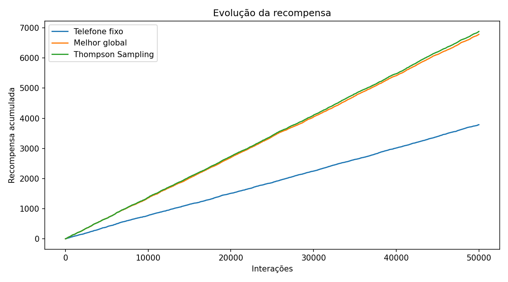
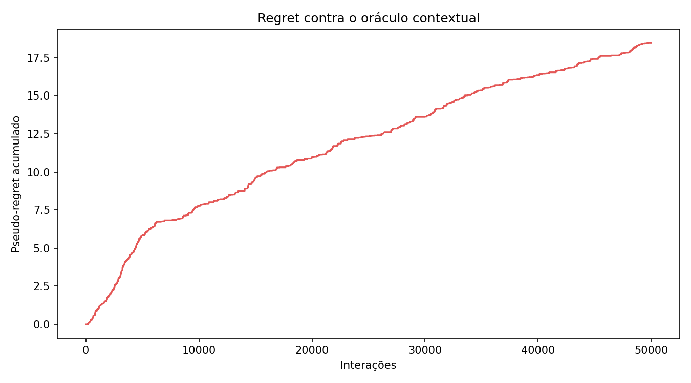
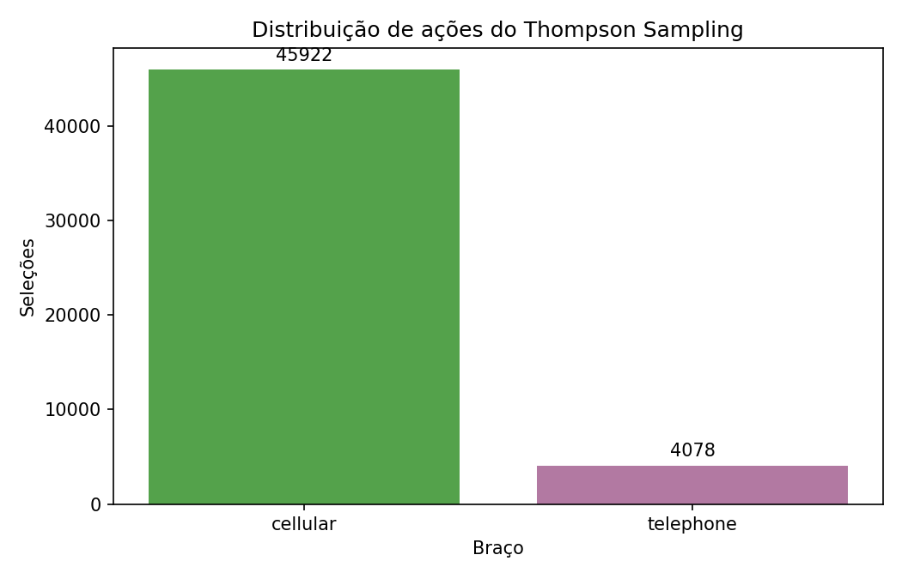

# Datathon MLET — Decisão Adaptativa de Canais

Plataforma end-to-end que recomenda `cellular` ou `telephone` para uma oportunidade de contato. A entrega compara o baseline determinístico `always_telephone` com Thompson Sampling contextual por segmentos, persiste uma política explicável, expõe uma API FastAPI e registra o experimento no MLflow local.

No experimento reproduzível com seed 42 e 50.000 interações, a política adaptativa alcançou **13,764%** de conversão simulada contra **7,574%** do baseline oficial: lift de **6,190 pontos percentuais** ou **81,73%**. Esse resultado é de uma simulação calibrada em dados observacionais, não uma estimativa causal.

## Problema de negócio e impacto esperado

Uma regra fixa de contato não reage ao contexto nem aprende com feedback. A hipótese é que uma política adaptativa, usando apenas três atributos operacionais não sensíveis, direcione mais interações ao canal com maior recompensa esperada em cada segmento. No ambiente simulado desta entrega, isso representa 3.095 recompensas adicionais frente ao telefone fixo em 50.000 decisões. Em produção, o ganho deve ser confirmado por experimento controlado antes de qualquer alegação de impacto real.

## Dados, target e ações

- Fonte pública: [Bank Marketing, por henriqueyamahata no Kaggle](https://www.kaggle.com/datasets/henriqueyamahata/bank-marketing) (`henriqueyamahata/bank-marketing`).
- Arquivo selecionado automaticamente: `data/raw/bank-additional-full.csv`.
- Volume bruto e utilizável: 41.188 linhas.
- Target: `y`, normalizado para recompensa `0/1`; conversão observada geral de 11,27%.
- Braços: `cellular` e `telephone`.
- Registros com canal desconhecido/não suportado removidos: 0 nesta variante da base.
- Split determinístico: 32.950 linhas de treino e 8.238 de teste.

O loader procura recursivamente variantes CSV em `data/raw/`, escolhe um arquivo pelo schema e, se nada for encontrado, tenta baixar o slug público com KaggleHub. Para uso sem rede, coloque um CSV compatível em `data/raw/`.

## Preparação, EDA e leakage

`duration` foi removida explicitamente antes da modelagem. Essa variável só é conhecida depois da interação e seu uso na decisão produziria vazamento temporal. A limpeza também normaliza o target, converte os campos numéricos e restringe o experimento aos dois braços válidos.

Resumo da EDA real:

| Recorte observado | Linhas | Conversão |
|---|---:|---:|
| Total utilizável | 41.188 | 11,27% |
| `cellular` | 26.144 | 14,74% |
| `telephone` | 15.044 | 5,23% |
| `poutcome=success` | — | 65,11% |
| `poutcome=failure` | — | 14,23% |
| `poutcome=nonexistent/other` | — | 8,83% |

O [notebook executado](notebooks/01_eda_bandit.ipynb) contém schema, qualidade, distribuições, análises do contexto e todos os outputs.

## Governança e minimização

Esta entrega usa apenas uma base pública e não contém informações reais de clientes da instituição. A decisão minimiza features para `poutcome`, `previous` e `campaign`; não usa renda, gênero, raça, patrimônio, identificadores pessoais ou outros atributos sensíveis. A finalidade é exclusivamente educacional/demonstrativa e os dados devem ser retidos localmente somente pelo período do projeto.

O histórico pode carregar viés de seleção e de campanhas passadas. A simulação não é causal, e qualquer decisão sensível requer humano no loop. Antes de produção são obrigatórios experimento controlado, análise de disparidades e monitoramento de drift, conversão, distribuição dos braços e eventuais degradações. Nenhum segredo ou credencial é armazenado no repositório.

## Baselines e política adaptativa

O comparador oficial é `always_telephone`: sempre escolhe `telephone`, independentemente do contexto. Como referência adicional, `global_best_historical` escolhe sempre o braço com maior conversão suavizada no treino, que nesta execução foi `cellular`.

O algoritmo adaptativo é Thompson Sampling contextual Beta-Bernoulli. Para cada `(segmento, braço)`, o prior é `Beta(1,1)` e o warm-start usa:

```text
alpha = 1 + sucessos
beta  = 1 + falhas
```

Pares segmento-braço com menos de cinco observações e segmentos desconhecidos usam o posterior global do braço como fallback. Durante a avaliação, a cada interação o algoritmo amostra um valor de cada posterior, escolhe o maior e atualiza `alpha` ou `beta` com a recompensa observada. O artefato de serving usa o maior posterior médio do snapshot para entregar respostas determinísticas e auditáveis; uma evolução online deve receber feedback e persistir atualizações.

### Contexto da decisão

A função única em `src/segmentation.py`, reutilizada por treino, notebook e API, cria no máximo 12 combinações a partir de:

- `poutcome`: `success`, `failure` ou `nonexistent/other`;
- `previous`: `0` ou `gt0`;
- `campaign`: `1-2` ou `3+`.

Exemplo: `poutcome=success|previous=gt0|campaign=1-2`. A base preparada ocupou seis segmentos.

## Avaliação offline

O dataset registra somente a recompensa do canal historicamente escolhido, sem contrafactual. Por isso, o treino estima `P(reward=1 | segmento, braço)` apenas no conjunto de treino, usando suavização Beta/Laplace. A sequência de contextos vem do teste e é repetida deterministicamente até 50.000 interações. Com seed 42, uma matriz de recompensa potencial é pré-gerada para cada interação e braço; todas as políticas usam exatamente essa mesma matriz.

O oráculo seleciona apenas para referência o braço de maior probabilidade estimada em cada contexto. O `cumulative_regret` é o pseudo-regret — soma da diferença entre a probabilidade do oráculo e a da ação adaptativa. Esta metodologia serve para comparação técnica reprodutível, mas **não é avaliação causal**, não elimina confounding e não substitui A/B test.

### Resultados reais

| Política | Conversão simulada | Recompensa acumulada |
|---|---:|---:|
| `always_telephone` (oficial) | 7,574% | 3.787 |
| `global_best_historical` (`cellular`) | 13,574% | 6.787 |
| `contextual_thompson_sampling` | **13,764%** | **6.882** |
| Oráculo contextual (somente referência) | — | 6.884 |

- Lift absoluto adaptativo vs. oficial: **6,190 p.p.**
- Lift relativo: **81,73%**.
- Pseudo-regret acumulado contra o oráculo: **18,4564**.
- Seleções do adaptativo: `cellular` 91,844%; `telephone` 8,156%.
- A política adaptativa também superou o baseline global nesta matriz comum, embora o critério oficial seja a comparação com `always_telephone`.









Os valores completos estão em [`artifacts/metrics.json`](artifacts/metrics.json), e o estado autocontido usado pela API está em [`artifacts/policy.json`](artifacts/policy.json).

## Golden Set

Os cinco casos abaixo estão persistidos em [`artifacts/golden_set.csv`](artifacts/golden_set.csv). As estimativas são taxas suavizadas do segmento; quando não há histórico suficiente, aplica-se o fallback global.

| Caso | Contexto (`poutcome`, `previous`, `campaign`) | Segmento | Recomendação | Estimada | Alternativa | Estimada alternativa | Justificativa |
|---|---|---|---|---:|---|---:|---|
| GS-001 | `success`, 1, 1 | `poutcome=success\|previous=gt0\|campaign=1-2` | cellular | 65,61% | telephone | 58,73% | Maior taxa suavizada do segmento. |
| GS-002 | `failure`, 1, 2 | `poutcome=failure\|previous=gt0\|campaign=1-2` | telephone | 15,92% | cellular | 14,64% | Maior taxa suavizada do segmento. |
| GS-003 | `nonexistent`, 0, 1 | `poutcome=nonexistent/other\|previous=0\|campaign=1-2` | cellular | 12,42% | telephone | 4,83% | Maior taxa suavizada do segmento. |
| GS-004 | `nonexistent`, 0, 4 | `poutcome=nonexistent/other\|previous=0\|campaign=3+` | cellular | 9,55% | telephone | 4,17% | Maior taxa suavizada do segmento. |
| GS-005 | `failure`, 0, 3 | `poutcome=failure\|previous=0\|campaign=3+` | cellular | 14,51% | telephone | 5,10% | Fallback global por falta de histórico suficiente. |

## Estrutura

```text
.
├── README.md
├── requirements.txt
├── data/raw/                  # CSV local (ignorado pelo Git)
├── notebooks/
│   └── 01_eda_bandit.ipynb   # executado, com outputs
├── src/
│   ├── data.py
│   ├── segmentation.py
│   ├── bandits.py
│   ├── evaluation.py
│   └── artifacts.py
├── scripts/
│   ├── train.py
│   └── create_notebook.py
├── app/main.py
├── artifacts/                # política, métricas, Golden Set e gráficos
└── tests/
    ├── test_segmentation.py
    ├── test_bandit.py
    └── test_api.py
```

## Instalação e execução local

Requer Python 3.11 ou superior. A partir da raiz:

```bash
python -m venv .venv
# Linux/macOS: source .venv/bin/activate
# Windows PowerShell: .venv\Scripts\Activate.ps1
python -m pip install -r requirements.txt
```

O pipeline baixa a base automaticamente quando possível. Sem acesso ao Kaggle, baixe manualmente pelo link acima e coloque qualquer variante CSV compatível em `data/raw/`. Para reproduzir treino, simulação, artefatos e run do MLflow:

```bash
python scripts/train.py
```

Para recriar e executar o notebook:

```bash
python scripts/create_notebook.py
python -m nbconvert --to notebook --execute notebooks/01_eda_bandit.ipynb \
  --output 01_eda_bandit.ipynb --output-dir notebooks \
  --ExecutePreprocessor.timeout=600
```

Equivalente, quando o launcher estiver no `PATH`: `jupyter nbconvert ...`.

### API

Inicie o serviço a partir da raiz, depois de gerar `artifacts/policy.json`:

```bash
uvicorn app.main:app --host 0.0.0.0 --port 8000
```

Se o artefato não existir, `/recommend` retorna HTTP 503 com a instrução para executar o treino. Exemplos:

```bash
curl http://localhost:8000/health
```

```bash
curl -X POST http://localhost:8000/recommend \
  -H "Content-Type: application/json" \
  -d '{"poutcome":"success","previous":1,"campaign":1}'
```

A resposta contém ação recomendada e alternativa, segmento, estimativas, nome e versão da política. A documentação interativa fica em `http://localhost:8000/docs`.

### MLflow

O experimento `datathon_adaptive_offers` usa `mlflow.db` como backend SQLite local. O run registra slug, algoritmo, braços, priors, seed, definição de segmento, tamanhos dos splits, número de interações, métricas e todos os artefatos. Abra a UI com:

```bash
mlflow ui --backend-store-uri sqlite:///mlflow.db --port 5000
```

Se o executável do usuário não estiver no `PATH`:

```bash
python -m mlflow ui --backend-store-uri sqlite:///mlflow.db --port 5000
```

Acesse `http://localhost:5000`. Em versões cujo tracking padrão já aponta para esse banco, `mlflow ui --port 5000` também é suficiente.

### Testes

```bash
python -m pytest -q
```

Os testes são unitários, usam fixtures sintéticas mínimas e não dependem da base completa. Cobrem segmentação, braços, atualização Beta, fallback, serialização, `/health`, `/recommend`, política ausente e validação de payload.

## Arquitetura-alvo AWS

Em uma evolução de produção, os dados e artefatos versionados ficam no Amazon S3; a imagem da FastAPI é publicada no ECR e executada no ECS Fargate atrás de um Application Load Balancer. CloudWatch centraliza logs, métricas e alarmes, enquanto o Secrets Manager guarda credenciais. A aplicação carrega no startup uma versão promovida de `policy.json` do S3 e emite telemetria de decisões sem atributos pessoais.

O MLflow pode rodar em ECS ou EC2, com RDS como backend transacional e S3 como artifact store. Um pipeline futuro no GitHub Actions executa testes, treino controlado, valida gates e promove imagem/política por ambiente. Esta é apenas a arquitetura-alvo documentada; nenhum recurso AWS foi provisionado nesta entrega.

## Limitações e próximos passos

- Recompensas dos braços não escolhidos são simuladas, não observadas.
- A estimativa aprende associações históricas e pode reproduzir viés de seleção.
- Segmentos discretos favorecem explicabilidade, mas perdem nuances e alguns pares são esparsos.
- O snapshot da API não recebe feedback; aprendizado online requer contrato de eventos, idempotência, persistência e rollback.
- Próximos passos: A/B test com guardrails, propensity logging, avaliação off-policy, monitoramento por segmento, análise de equidade, autenticação e CI/CD.

## Checklist das Etapas 0–7

- [x] Etapa 0 — repositório organizado, requirements e README autocontido.
- [x] Etapa 1 — fonte Kaggle e notebook de EDA executado.
- [x] Etapa 2 — target binário, braços válidos, contexto minimizado e `duration` removida.
- [x] Etapa 3 — baseline fixo, baseline global e Thompson Sampling; adaptativo acima do oficial.
- [x] Etapa 4 — métricas, quatro gráficos, Golden Set com exatamente cinco casos e testes.
- [x] Etapa 5 — FastAPI com `/health` e `/recommend`.
- [x] Etapa 6 — arquitetura-alvo AWS documentada, sem provisionamento.
- [x] Etapa 7 — experimento MLflow local com params, métricas e artefatos.
- [x] Etapa 8 — vídeo, explicitamente fora do escopo desta entrega.
